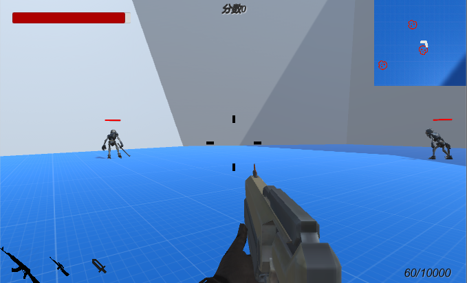
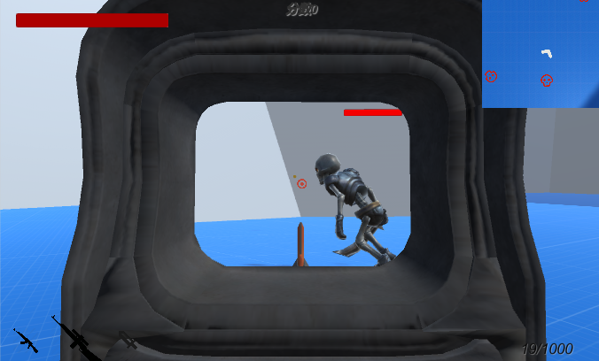
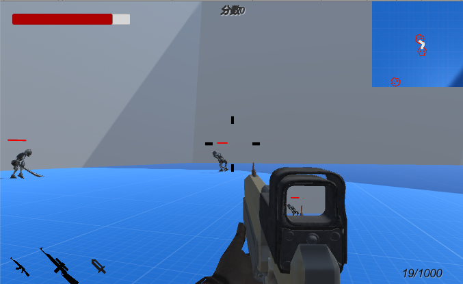
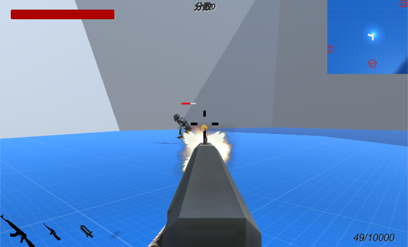
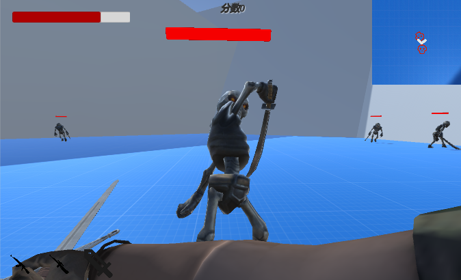

# FPSShooter
第一人称射击游戏

没什么玩头，主要是模仿Assets/Other/Easy FPS/_scene中的操作效果，并将最近所学应用到此项目中

### 操作
WASD：移动

鼠标左键：开火/攻击

鼠标右键：瞄准

空格：跳跃

R：装填子弹

LShift：加速

esc:暂停

LAlt: 显示鼠标

### 演示

|   |   |
|---|---|
| ||
| ||
|| |

### 实现功能
* 利用FSM和Animator配合改变敌人动画和状态 
* 利用对象池技术来加载敌人、子弹 
* 利用json来存储武器、敌人配置信息 
* 利用RenderTexture制作倍镜效果 
* 在UGUI下实现UI页面的管理功能 

